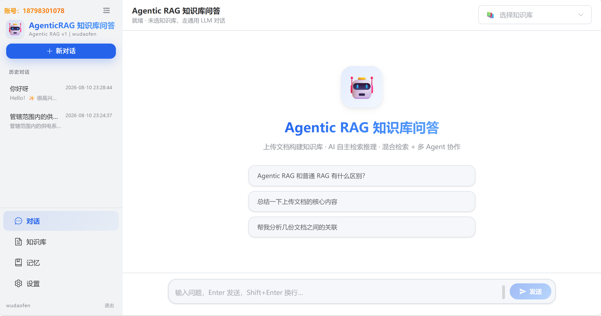
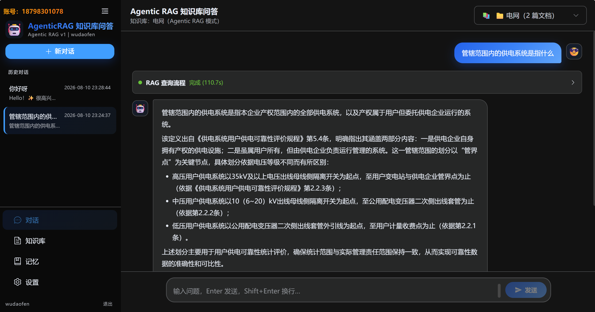
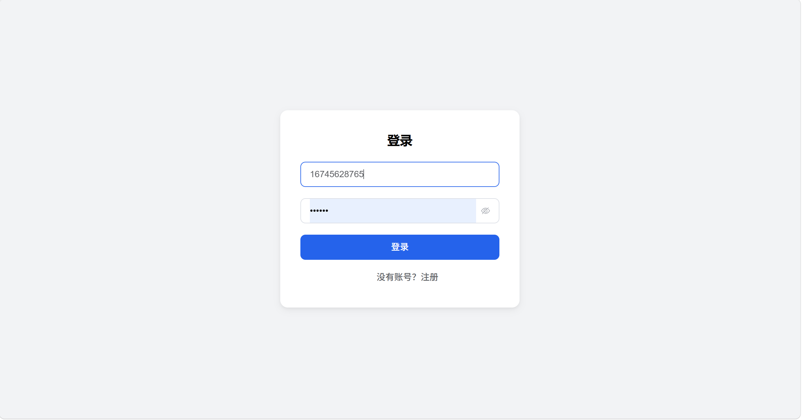
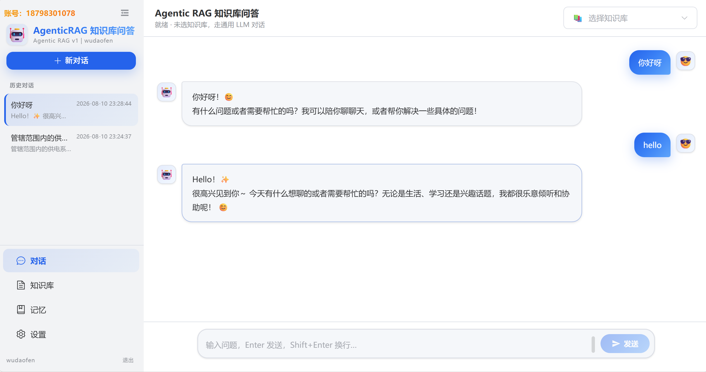
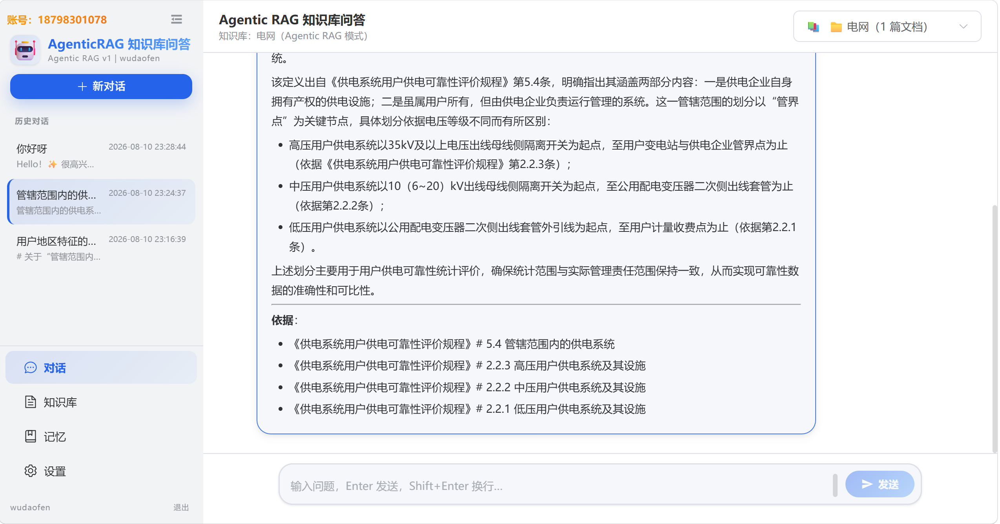
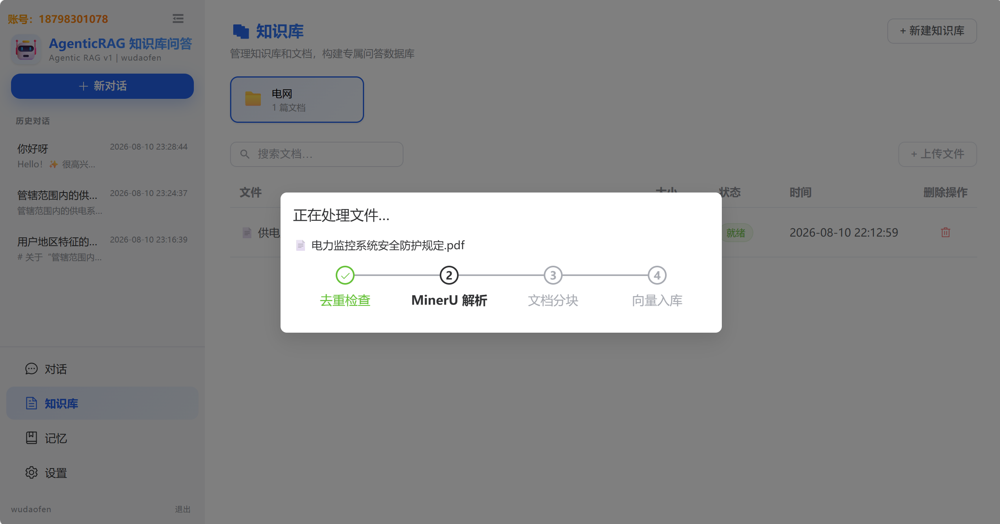
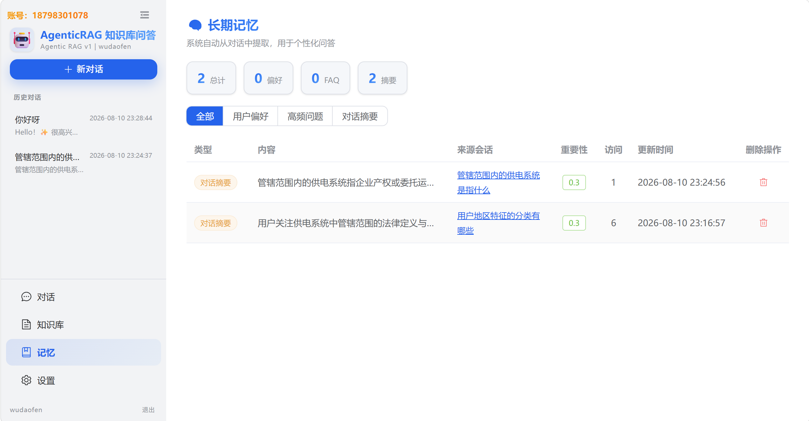
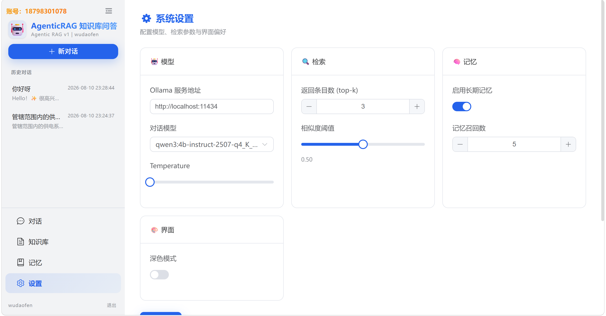
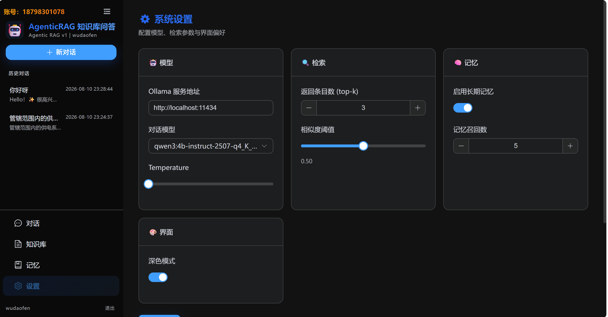

# Agentic RAG KBQA

基于 LangGraph 的 Agentic RAG 知识库问答系统。上传文档到知识库，对话时 Agent 自主检索、分析、综合多份文档后生成回答。


## 整体架构

```
┌──────────────────────────────────────────────────────┐
│  前端 (Vue 3 + Element Plus)                         │
│  ChatView / DocumentsView / MemoryView / SettingsView │
└──────────────────────┬───────────────────────────────┘
                       │ SSE / REST (JWT 认证)
┌──────────────────────▼───────────────────────────────┐
│  后端 (FastAPI)                                      │
│                                                      │
│  POST /chat/stream  ← SSE 流式对话                    │
│  POST /documents    ← 文档上传 + SSE 进度              │
│                                                      │
│  ┌─────────────────────────────────────────────┐     │
│  │  摄入管线：SHA256 去重 → MinerU → 父子分块     │     │
│  │  → Qdrant 向量化                             │     │
│  └─────────────────────────────────────────────┘     │
│                                                      │
│  ┌─────────────────────────────────────────────┐     │
│  │  Agentic RAG (LangGraph)                     │     │
│  │  主图：加载记忆 → 摘要历史 → 改写/拆解问题      │     │
│  │    → Agent 子图 (多实例并行) → 汇总回答        │     │
│  │  Agent 子图：orchestrator ←→ tools            │     │
│  │  自主决策：搜一轮 → 分析 → 不够就换策略继续搜   │     │
│  └─────────────────────────────────────────────┘     │
│                                                      │
│  ┌─────────────────────────────────────────────┐     │
│  │  长期记忆：LLM 提取 → Qdrant + SQLite 双写    │     │
│  │  按会话隔离，importance × recency 融合排序    │     │
│  └─────────────────────────────────────────────┘     │
└──────┬──────────────────────┬────────────────────────┘
       │                      │
┌──────▼──────┐    ┌──────────▼──────────┐
│  Qdrant     │    │  SQLite             │
│  混合检索    │    │  用户/文档/会话/记忆  │
│  父子块      │    │  LangGraph 存档     │
└─────────────┘    └─────────────────────┘
       │
┌──────▼──────┐    ┌──────────────────┐
│  Ollama     │    │  MinerU API      │
│  LLM + Emb  │    │  PDF 解析 (可选)  │
└─────────────┘    └──────────────────┘
```

## 快速开始

依赖：Python 3.12、Node 20+、Ollama、MinerU（可选）

```bash
# 1. Ollama
ollama serve
ollama pull qwen3:4b-instruct-2507-q4_K_M

# 2. MinerU（需要 PDF 解析时）
pip install uv -i https://mirrors.aliyun.com/pypi/simple
uv pip install -U "mineru[all]" -i https://mirrors.aliyun.com/pypi/simple
mineru-api --host 127.0.0.1 --port 8085

# 3. 后端
cd backend
pip install -r requirements.txt
python run.py                    # 端口 8000

# 4. 前端
cd frontend
npm install
npm run dev                      # 端口 5173
```

首次使用需要注册账号（手机号 + 密码），之后用 JWT token 认证。所有数据按用户隔离。

## 核心功能

### 文档处理

上传 PDF/Markdown → SHA256 去重（同 KB 内） → MinerU 转 Markdown → 父子分块 → Qdrant 向量化。

Web 界面实时显示进度：去重检查 → MinerU 解析 → 文档分块 → 向量入库。中间文件保存在 `data/` 下，失败自动清理，成功保留。

MinerU 配置文件：`backend/config/mineru.yml`。

### Agentic RAG 工作流

和普通 RAG 的区别：不是搜一次直接回答，而是 Agent 自主决策——拆解问题、多轮检索、分析对比、交叉验证后再汇总。

```
用户提问 → 加载长期记忆 → 摘要对话历史 → LLM 改写/拆解问题
  → 不够明确？中断让用户补充
  → 明确 → 多 Agent 并行，各自处理一个子问题
    → orchestrator 决策：信息够不够？要不要换关键词？
    → 够了 → 汇总输出，不够 → 继续搜（循环）
  → aggregate 汇总所有子答案
```

熔断机制：工具调用次数和迭代轮次有上限，超限自动用已有信息回答。

### 混合检索

密集向量 (bge-large-zh-v1.5) + BM25 稀疏检索，Qdrant RRF 融合。检索命中子块后回溯完整父块，给 LLM 的上下文兼顾精度和背景。

### 长期记忆

每轮对话后 LLM 自动提取，按会话隔离，跨会话不泄露：

| 类型 | 初始重要性 | 说明 |
|------|-----------|------|
| conversation_summary | 0.3 | 当前会话摘要，随对话更新覆盖 |
| user_preference | 0.6 | 用户偏好（"回答简洁"等） |
| faq_pattern | 0.8 | 同主题被命中 3 次自动升级 |

检索时按 importance × recency 融合排序：24h 内 ×1.3，7 天内 ×1.1，30 天后 ×0.85。

### 多用户

JWT 认证，手机号注册。所有数据（知识库、文档、会话、记忆、设置、主题）按用户隔离。设置存 `data/settings_{user_id}.json`。

## 配置

| 位置 | 内容 |
|------|------|
| `backend/.env.dev` | LLM、端口、chunk 参数等 |
| `backend/config/mineru.yml` | MinerU API 地址和参数 |
| Web 设置页 | 模型、top-k、记忆开关、主题 |
| `data/settings_{user_id}.json` | 用户个性化配置持久化 |

## 界面
登录

对话-仅LLM

对话-RAG检索+LLM

文件处理

记忆管理

系统设置

深色模式-设置

深色模式-对话


## 项目结构

```
backend/
  app/
    api/v1/          # REST API (auth/chat/conversations/documents/uploads/kb/memories/settings)
    core/            # config.py、container.py
    domain/          # ORM 模型、Schema
    ingestion/       # 文档摄入：pipeline、dedup、extractor、chunker
    rag/             # LangGraph Agent：graph、nodes、edges、tools、memory、prompts
    services/        # 业务层：chat、conversation、document、auth、long_term_memory
    stores/          # 数据访问：qdrant、sqlite、parent、long_term_memory
  config/            # mineru.yml
  data/              # SQLite、上传文件、chunks、markdown、settings
frontend/
  src/
    views/           # Login、Chat、Documents、Memory、Settings
    components/      # 聊天组件、文档上传、侧边栏
    stores/          # Pinia
    composables/     # useChatStream
    router/          # 路由 + JWT 守卫
    api/             # axios 封装 + 拦截器
scripts/
```

## API

| 方法 | 路径 | 认证 | 说明 |
|------|------|------|------|
| POST | `/api/v1/auth/register` | 否 | 注册 |
| POST | `/api/v1/auth/login` | 否 | 登录 |
| GET | `/api/v1/health` | 否 | 健康检查 |
| POST | `/api/v1/chat/stream` | 是 | SSE 流式对话 |
| POST | `/api/v1/chat/resume` | 是 | 澄清中断恢复 |
| GET/POST/DELETE | `/api/v1/conversations` | 是 | 会话管理 |
| GET | `/api/v1/conversations/{id}/messages` | 是 | 消息历史 |
| GET/DELETE | `/api/v1/documents` | 是 | 文档管理 |
| POST | `/api/v1/documents` | 是 | 上传文档 |
| GET/POST/DELETE | `/api/v1/knowledge-bases` | 是 | 知识库 |
| GET/PATCH/DELETE | `/api/v1/memories` | 是 | 长期记忆 |
| GET/PUT | `/api/v1/settings` | 是 | 系统设置 |
| GET | `/api/v1/models` | 是 | Ollama 模型列表 |
